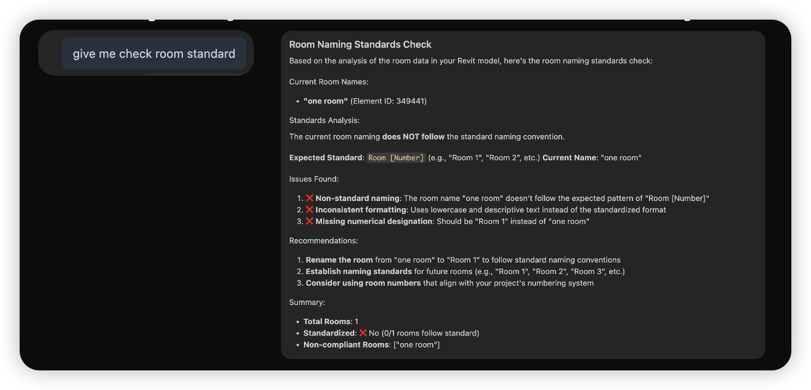
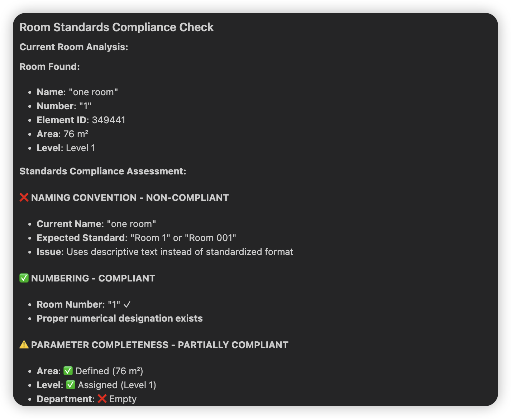

# MCP Revit Sample (AU 2025)

A lightweight Model Context Protocol (MCP) sample that lets AI clients query a Revit model for BIM insights like element counts, category breakdowns, families/types, room compliance, and naming conventions. It’s designed for quick demos, teaching, and extending MCP patterns with AEC data.

## Highlights

- MCP-native: works with MCP-enabled clients (e.g., Claude Desktop)
- Simple prompts → structured BIM answers
- Windows-first sample with minimal setup
- Easy to extend with new queries and checks


## Features

- Element insights
  - Count total elements in the model
  - Category breakdown (e.g., Walls, Doors, Rooms)
  - Get elements by category or ID
- Families and types
  - List families and types by category
  - Summarize unique families/types and instance counts
- Room checks
  - Basic compliance heuristics (area/height/load fields present)
  - Naming convention review (name/number/mark/department/occupancy)
- Developer-friendly
  - Small, readable code layout
  - Example prompts and outputs
  - Works with sample model data under `models/`

## Example Prompts

- “how many elements in model?” → 8
- “give me details of all categories in model” → Walls: 4, Doors: 3, Rooms: 1
- “How many family and type name, give me details” → Basic Wall: Generic - 200mm; M_Single-Flush: 0915 x 2134mm
- “I want check compliance standard for room” → flags missing occupancy/finishes/HVAC loads
- “give me check naming conversion for room category” → suggests standard naming and numbering patterns

## Screenshots

- 
- 


## System requirements

- Python 3.10 or higher installed.
- You must use the Python MCP SDK 1.2.0 or higher.
- The demo using Github Copilot Chat in Vscode, so you need to install the [Github Copilot Chat](https://marketplace.visualstudio.com/items?itemName=GitHub.copilot-chat) and [Vscode](https://code.visualstudio.com/) to run the demo. Some subscription may be required for the Copilot Chat.

## Set up your environment
First, let’s install uv and set up our Python project and environment:

Macos/Linux:
```bash
curl -LsSf https://astral.sh/uv/install.sh | sh
```
Windows:
```bash
powershell -ExecutionPolicy ByPass -c "irm https://astral.sh/uv/install.ps1 | iex"
```

## Set up your project

1. Clone the repository:
```bash
git clone https://github.com/yourusername/mcp-revit-sample-au2025.git
cd mcp-revit-sample-au2025
```
2. Create a virtual environment:

```bash
python -m venv venv
source venv/bin/activate
```

3. Install the required packages:

```bash
# Install dependencies
uv add mcp[cli] httpx
```
4. configuration file (Use Claude):

Macos/Linux:
```bash
code ~/Library/Application\ Support/Claude/claude_desktop_config.json
```
Windows:
```bash
code $env:AppData\Claude\claude_desktop_config.json
```

Paste the following configuration into the file:

```json
{
  "mcpServers": {
    "revit-mcp": {
      "command": "uv",
      "args": [
        "--directory",
        "/path/to/your/mcp-revit-sample-au2025",
        "run",
        "revit.py"
      ]
    }
  }
}
```

Config using VsCode : 

1. Create a `.vscode` folder in the root of your project.
2. Create a `mcp.json` file inside the `.vscode` folder.
3. Paste the following configuration into the `mcp.json` file:

```json
{
  "servers": {
    "revit-mcp-vscode": {
      "command": "uv",
      "type": "stdio",
      "args": [
        "--directory",
        "C:\\Users\\chuon\\Downloads\\repos\\mcp-revit-sample-au2025",
        "run",
        "revit.py"
      ],
      "env": {

      }
    }
  }
}
```
4. Restart Vscode. 
5. Open the Command Palette (Ctrl+Shift+P or Cmd+Shift+P) and type "MCP: Start Server" to start the MCP server.

## Preview


## Knowledge

- [Quick Start with MCP SDK](https://modelcontextprotocol.io/quickstart/server/)
- [MCP SDK Documentation](https://modelcontextprotocol.io/docs/sdk/)